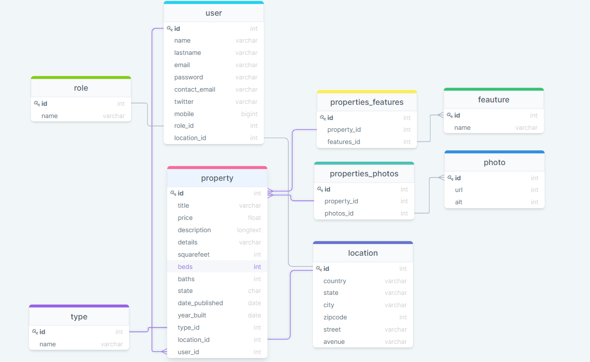

# Real State [REST API]
This is a REST Api for a fiction Real State Company © I built this API to practice my **Java** and **Spring Boot framework** skills. 🙂

## Build with 🛠️
* [MySQL](https://www.mysql.com) - Data Base.
* [Java-17](https://www.oracle.com/java/technologies/javase/jdk17-archive-downloads.html) - Backend Programming Language.
* [Spring Boot 2.5.6](https://spring.io/blog/2021/10/21/spring-boot-2-5-6-is-now-available) - Backend Framework.
* [Spring Data JPA](https://spring.io/projects/spring-data-jpa) - Java Persistence API
* [JWT](https://jwt.io/) -  Security token for API Authentication

## Features ✔😎
* REST Api contains users, properties, roles, features, photos, location and type (of properties).
* Database relationships One-to-Many, Many-to-Many, One-to-One.
* Implementing Data Transfer Objects (DTOs).
* Users can Create-Read-Update-Delete-Search properties, features, photos and locations.
* Swagger to test API.
* Upload photos of properties (Many-to-Many)
* JWT Authentication

## Authors ✒️

* **Oriol Cortez Cesar** - [Dev-OriolCC](https://github.com/Dev-OriolCC)

## Screenshots and gifs 📸

_1.1 Database_